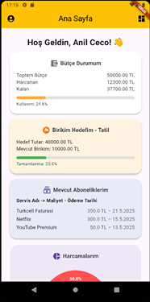
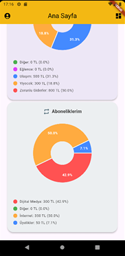
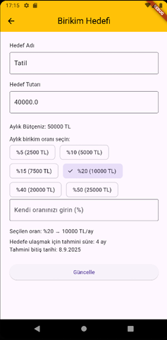

# 💰 CE-Tracking – Kişisel Finans Takip Uygulaması

CE-Tracking, bireylerin gelir ve giderlerini takip edebildiği, bütçe yönetimi yaparak hedef odaklı birikim süreci oluşturabildiği bulut tabanlı bir mobil uygulamadır.  
Flutter ve Firebase teknolojileri kullanılarak geliştirilmiştir.

---

## 🧩 Özellikler

- 📊 **Gelir & Gider Takibi** – Harcamalarınızı kategorilere göre kaydedin ve analiz edin.  
- 🧮 **Bütçe Yönetimi** – Aylık bütçenizi belirleyin ve aşım oranlarını takip edin.  
- 🎯 **Hedefe Yönelik Birikim** – Oran bazlı birikim planı oluşturun, süreci sistem otomatik yönetsin.  
- 🔁 **Abonelik Takibi** – Düzenli ödemelerinizi kaydedin ve otomatik olarak takip edin.  
- ☁️ **Cloud Functions Entegrasyonu** – Gerçek zamanlı hesaplama, bildirim ve arka plan güncellemeleri.  

---

## 📷 Ekran Görüntüleri

Ana sayfa ve birikim modülü gibi bazı temel ekranlar:

  
  
  

---

## 🔧 Kullanılan Teknolojiler

- **Frontend:** Flutter SDK, Dart  
- **Backend:** Firebase (Authentication, Firestore, Cloud Functions)  
- **Platform:** Google Firebase (PaaS)  
- **Ekstra:** Node.js (fonksiyonel hesaplamalar için)

---

## 🔒 Güvenlik Notu

Bu projede güvenlik amacıyla özel **Firebase bağlantı dosyaları** paylaşılmamıştır.

---
